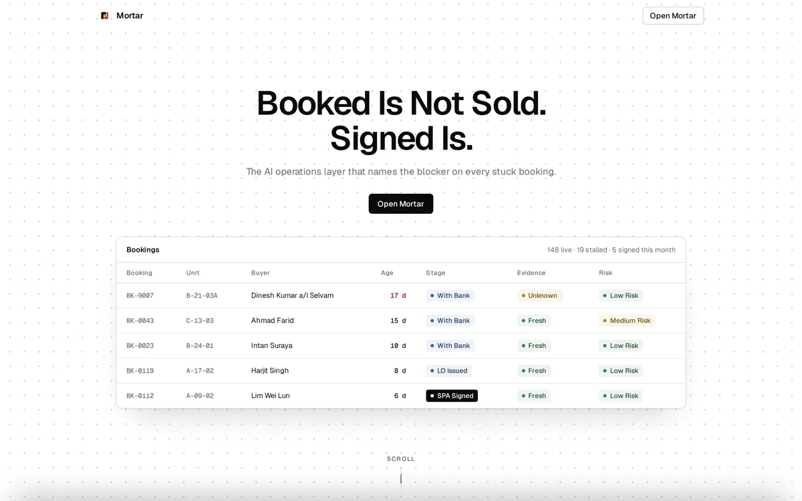
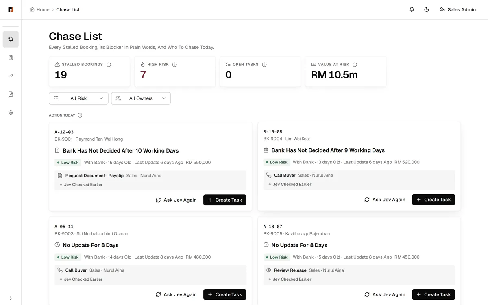
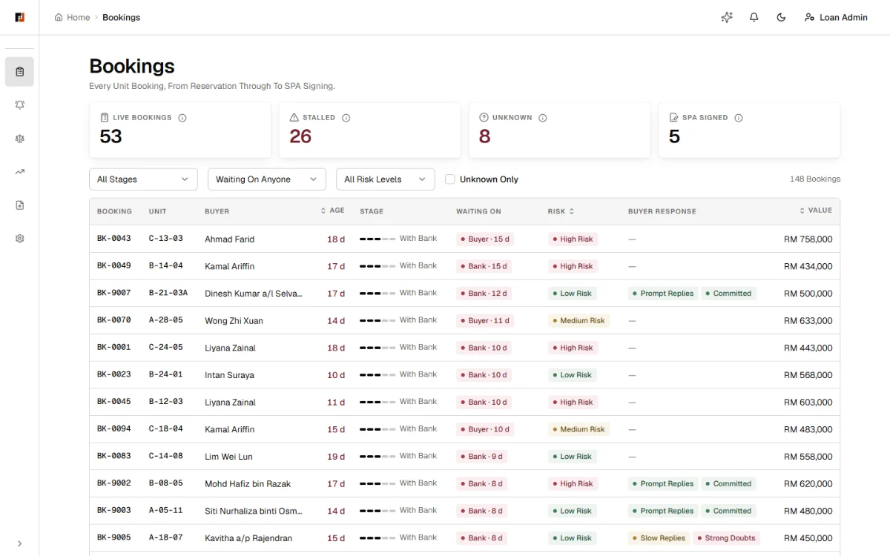
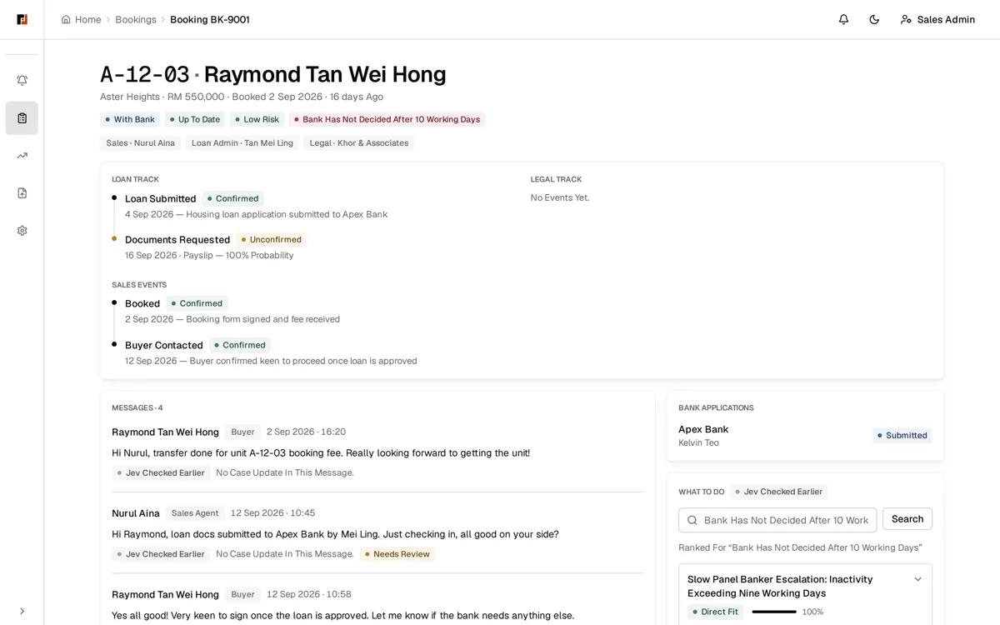
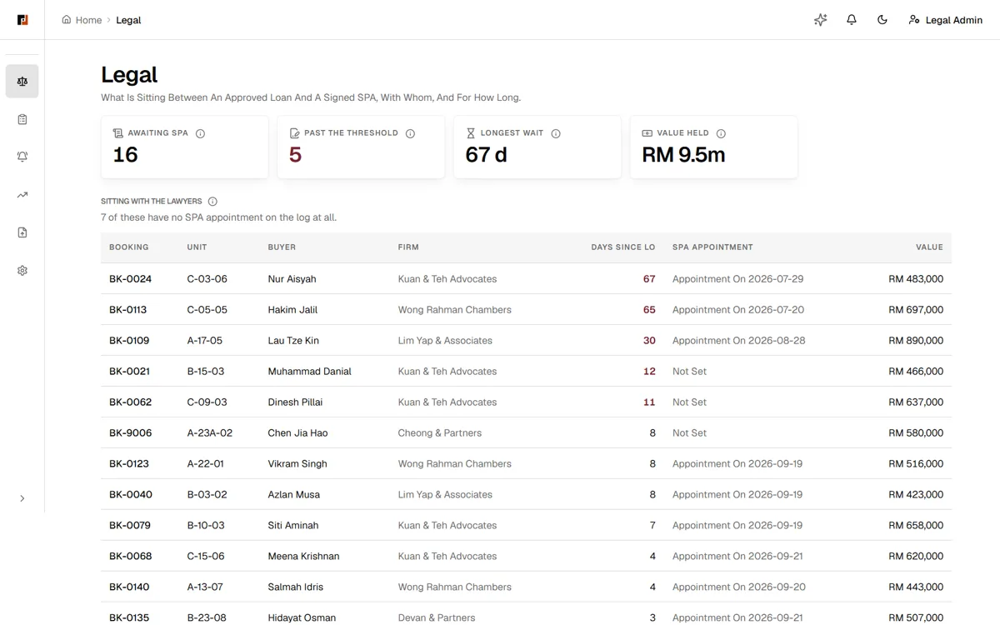
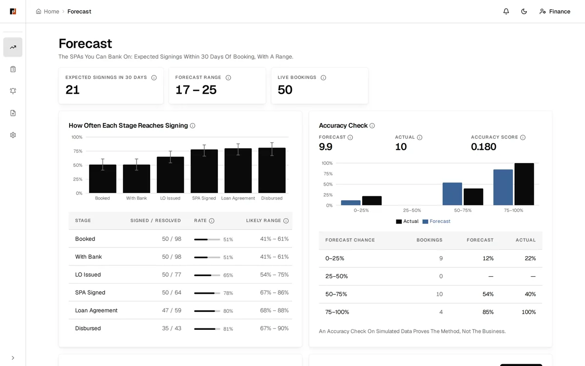
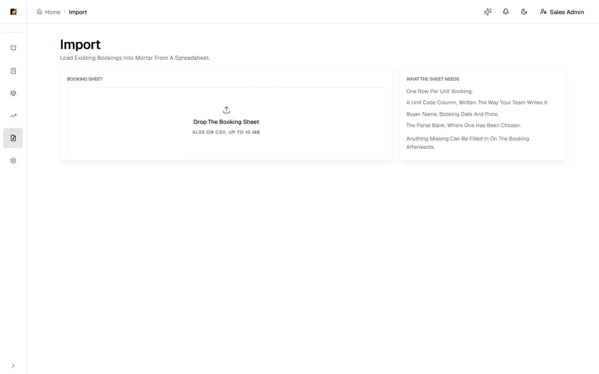
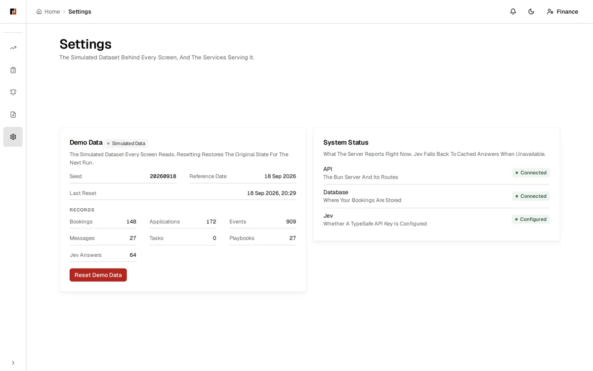
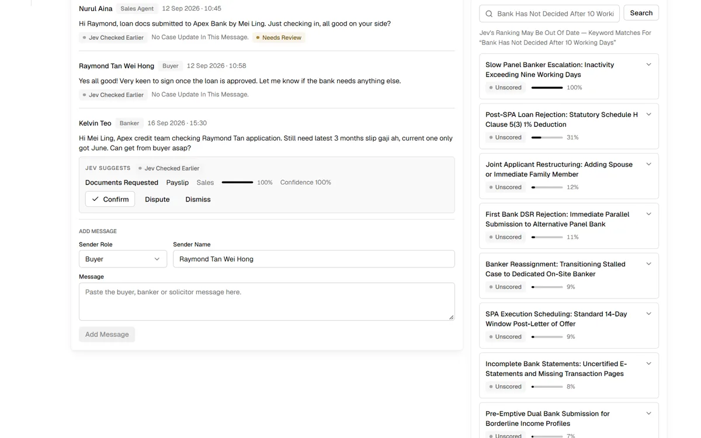
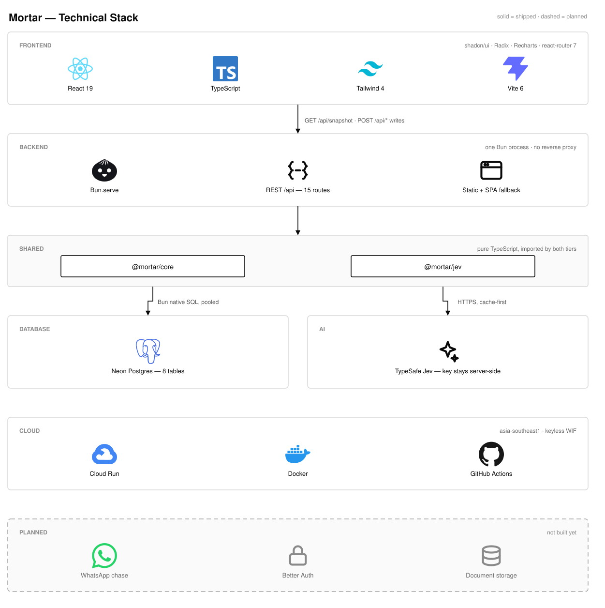

<a id="readme-top"></a>

<div align="center">
  

  <h3>Mortar</h3>

  <p>
    <b>Know which bookings will really become sales.</b><br />
    One live view of every booking across Sales, Loan Admin and Legal — a
    daily chase list for the stuck ones, and a cash forecast that only counts
    bookings likely to sign.
  </p>


[Live Prototype](https://mortar-ppdggwxxjq-as.a.run.app) ·
[Figma](https://www.figma.com/design/CTy3FDK15W2QLQmB3h5f1I/Mortar-Design-System?node-id=0-1&t=BmfrHmxUj0uuvRDc-1)
· [Design Spec](DESIGN.md) · [Problem Statement](source/problem-statement.md) ·
[Interview](source/interview.md) · [AGENTS](../AGENTS.md)

</div>

## Table of Contents

<details>
  <summary>Expand</summary>
  <ol>
    <li><a href="#about-the-project">About The Project</a></li>
    <li><a href="#the-one-rule-that-governs-everything">The One Rule That Governs Everything</a></li>
    <li><a href="#how-it-works">How It Works</a></li>
    <li><a href="#what-is-built">What Is Built</a></li>
    <li><a href="#screenshots">Screenshots</a></li>
    <li><a href="#architecture">Architecture</a></li>
    <li><a href="#tech-stack">Tech Stack</a></li>
    <li><a href="#getting-started">Getting Started</a></li>
    <li><a href="#project-structure">Project Structure</a></li>
    <li><a href="#limitations">Limitations</a></li>
    <li><a href="#team">Team</a></li>
    <li><a href="#license">License</a></li>
  </ol>
</details>

---

## About The Project

A property project launches, Sales books units in the first month, and the
launch is reported as a success. But a meaningful share of those bookings never
reaches a signed Sale &amp; Purchase Agreement (SPA): loans are rejected, buyers
withdraw, paperwork stalls, or the case sits with a panel banker and quietly
dies.

Each booking can hold a unit off the market for six to twelve weeks while it
consumes marketing spend, agent commission accruals, and legal panel time.
Nobody can say, for a live project, how many booked units are likely to convert
— and the developer's cash flow forecast is built on bookings.

**Illustrative only:** 200 launch bookings at RM600k with 20% never converting
is RM24M of reported sales that is not real.

Built by **NexTechnologies** for the YEI 3.0 Youth Innovation Sandbox by Kabel
(Premium track), tackling the Chin Hin Group property booking conversion
challenge. Proposal PDF and pitch video are due Sunday, 20 September 2026.

<p align="right"><a href="#readme-top">&uarr;</a></p>

---

## The One Rule That Governs Everything

**A booking is never counted as cash at face value.**

Every booking enters the forecast at the historical conversion rate of its
current stage — enforced in `@mortar/core`, not in a dashboard label somebody
could forget to apply. The consequences are worn openly:

- The forecast can only move toward honesty as evidence arrives; a stalled
  booking drags the number down instead of inflating it
- Success is one number, readable within a quarter: the percentage of bookings
  that sign the SPA within 30 days — a cash outcome, not a dashboard
- Every booking is screened within 48 hours; the salvageable get chased and
  doomed units are released early, rather than blocking bookings upstream with
  stricter pre-qualification

<p align="right"><a href="#readme-top">&uarr;</a></p>

---

## How It Works

The funnel runs from booking fee to bank disbursement:

1. Booking (small fee)
2. Loan application(s), often several banks at once
3. Letter of Offer
4. SPA signed (buyer pays 10%)
5. Loan agreement (panel solicitor)
6. Bank disburses progressively

Sales, Credit/Loan Admin and Legal each hold one slice of that funnel and no
existing tool shows the whole. Mortar's input is the booking spreadsheet the
team already maintains — intake, not migration — and its rules push a daily
chase list instead of waiting for somebody to open a report.

The app is used as three personas, switched in the header and persisted in
`localStorage`:

| Persona     | Home Route  | Job                                                        |
| ----------- | ----------- | ---------------------------------------------------------- |
| Sales Admin | `/chase`    | Works the daily chase list of stuck bookings               |
| Loan Admin  | `/bookings` | Tracks loan and banker status across bookings              |
| Legal Admin | `/legal`    | Works the queue of unsigned SPAs by how long they have sat |

| Route           | Purpose                                                           |
| --------------- | ----------------------------------------------------------------- |
| `/`             | Public landing page                                               |
| `/sign-in`      | Persona picker, no real authentication                            |
| `/app`          | Redirects to the active persona's home                            |
| `/bookings`     | Every live booking with stage and risk flags                      |
| `/bookings/:id` | Stage timeline and missing-document checklist for one booking     |
| `/chase`        | Who to chase today, with WhatsApp click-to-chat links             |
| `/legal`        | Approved loans with no signed SPA, longest wait first             |
| `/forecast`     | What will sign, then where bookings died and what was recoverable |
| `/import`       | Spreadsheet intake                                                |
| `/faq`          | FAQ                                                               |
| `/settings`     | Demo dataset controls, reset, and server health                   |

<p align="right"><a href="#readme-top">&uarr;</a></p>

---

## What Is Built

Measured, not estimated.

|                               |        |
| ----------------------------- | ------ |
| Live routes                   | **11** |
| Personas                      | **3**  |
| Funnel stages tracked         | **6**  |
| Shared packages               | **2**  |
| Backend services              | **1**  |
| Real buyer records in the app | **0**  |

The shell, routes, and persona switch are built and deployed, and the screens
walk the primary flows on seeded bookings. The `@mortar/core` domain rules —
stage tracking, risk flags, chase list, risk-weighted forecast — are in place
behind a Bun API reading Postgres.

<p align="right"><a href="#readme-top">&uarr;</a></p>

---

## Screenshots

Every shot below is the running app on the seeded demo dataset. The data is
simulated; the screens are not mockups.

| Landing                                                                  | Chase                                                                                    | Bookings                                                                               |
| ------------------------------------------------------------------------ | ---------------------------------------------------------------------------------------- | -------------------------------------------------------------------------------------- |
|                   |                          |                                     |
| The public entry point: the claim, and how the three desks fit together. | Sales Admin's daily list. Stalled bookings first, each with Jev's suggested next action. | Loan Admin's desk. Every booking with age, stage, update freshness and financing risk. |

| Case Page                                                                    | Legal                                                                             | Forecast                                                                             |
| ---------------------------------------------------------------------------- | --------------------------------------------------------------------------------- | ------------------------------------------------------------------------------------ |
|                       |               |                   |
| One booking end to end: loan and legal tracks, messages, tasks and evidence. | What sits between an approved loan and a signed SPA, with whom, and for how long. | Expected signings inside 30 days, with stage conversion rates and an accuracy check. |

| Import                                                                  | Settings                                                            | Jev Proposal                                                                      |
| ----------------------------------------------------------------------- | ------------------------------------------------------------------- | --------------------------------------------------------------------------------- |
|               |     |   |
| Load existing bookings from a spreadsheet. Parsing is not wired up yet. | The demo dataset: seed, reference date, record counts, and a reset. | Jev reads each message and proposes an update. Staff confirm, dispute or dismiss. |

<p align="right"><a href="#readme-top">&uarr;</a></p>

---

## Architecture

One deployable and two shared libraries. A single Bun process serves `/api/*`
and the built frontend, bookings live in Postgres, and the domain rules stay
pure TypeScript in `@mortar/core`.

The diagram is the whole stack, including the parts not built yet — **solid is
shipped today, dashed is planned.**



<details>
  <summary>Text version</summary>

```text
Browser — React 19 SPA
  SnapshotProvider derives every view through @mortar/core
        |
        |  GET /api/snapshot  ·  POST /api/* writes
        v
Google Cloud Run (asia-southeast1)
        |
        v
Bun.serve — one process, server/src/index.ts
  frontend/dist + SPA fallback  ·  /api/* (12 routes)
        |
        |             @mortar/jev ──> TypeSafe Jev (jev-latest)
        |             key stays server-side, cache-first
        v
Neon PostgreSQL — Bun native SQL, pooled
  bookings · loan_applications · events · messages
  tasks · playbooks · jev_answers · meta

@mortar/core is imported by the browser and the server alike,
so a booking has one definition and never two.
```

</details>

Editable source: [`assets/architecture.drawio`](assets/architecture.drawio) —
open it at [draw.io](https://app.diagrams.net) and re-export the `.svg` and
`.png` after any change.

| Piece            | Runs                     | Job                                                       |
| ---------------- | ------------------------ | --------------------------------------------------------- |
| `frontend/`      | Built to `frontend/dist` | React 19 + Vite SPA, served by the Bun process            |
| `server/`        | Cloud Run                | `Bun.serve`: static assets, `/api/*`, SQL schema on boot  |
| `packages/core/` | Browser and server       | `@mortar/core`: contract types, domain rules, forecasting |
| `packages/jev/`  | Server only              | `@mortar/jev`: TypeSafe Jev client, questions, fallbacks  |
| `docs/`          | Repo                     | This file, the design spec, sources, agent notes          |

Every push to `main` deploys automatically through GitHub Actions to Cloud Run
in `asia-southeast1`, with keyless Workload Identity Federation.

<p align="right"><a href="#readme-top">&uarr;</a></p>

---

## Tech Stack

| Layer    | Choice                                                     |
| -------- | ---------------------------------------------------------- |
| Frontend | React 19, react-router 7, Vite 6, TypeScript               |
| Backend  | Bun HTTP server, `@mortar/core` and `@mortar/jev`          |
| Database | Postgres, schema and seed applied on first boot            |
| Tooling  | Bun 1.3.14 workspaces (`frontend`, `packages/*`, `server`) |
| Styling  | Tailwind CSS 4, shadcn/ui (Radix)                          |
| Charts   | Recharts 3                                                 |
| State    | React Context for persona; case data from `/api`           |
| Tests    | Vitest, Testing Library, jsdom                             |
| Serving  | One Bun process serves `/api/*` and `frontend/dist`        |
| AI       | Jev: TypeSafe AI SDK; precomputed answers without a key    |
| Hosting  | Google Cloud Run (`asia-southeast1`)                       |

<p align="right"><a href="#readme-top">&uarr;</a></p>

---

## Getting Started

The app needs Postgres. Copy `.env.example` to `.env` at the repo root and set
`DATABASE_URL`; an empty database is fine, because the server applies the schema
and seeds the canonical dataset on first boot.

```sh
docker run -d --name mortar-pg -e POSTGRES_PASSWORD=mortar \
  -e POSTGRES_DB=mortar -p 5432:5432 postgres:17-alpine
bun install
bun run dev        # frontend :5173, API :8787
```

```sh
bun run dev        # Start the Bun API and the Vite dev server together
bun run check      # Lint, typecheck, and test across workspaces
bun run format     # Prettier formatting across the repository
bun run build      # tsc -b && vite build → frontend/dist/
bun run db:reset   # Re-seed the database deterministically
```

Prerequisites: [Bun 1.3.14](https://bun.sh/) (pinned by `packageManager` in
`package.json`), Postgres 17, and a modern desktop browser.

<p align="right"><a href="#readme-top">&uarr;</a></p>

---

## Project Structure

```text
docs/            This file, DESIGN.md, sources, agent notes
frontend/        The app: React 19 + Vite SPA
  src/pages/     One file per route
  src/components/layout/, ui/ (shadcn), charts/
  src/lib/       Persona context, stores, formatters
packages/core/   @mortar/core: shared TypeScript domain rules
packages/jev/    @mortar/jev: proposals, playbooks, answer cache
server/          Bun API over Postgres; also serves frontend/dist
  db/            Schema, seed, and row mappers
  src/           Routes, Jev cache, static handler
.github/         CI and Cloud Run deploy workflows
Dockerfile       Bun build → Bun alpine runtime
AGENTS.md        Agent instructions: stack, routes, rules
```

<p align="right"><a href="#readme-top">&uarr;</a></p>

---

## Limitations

- **Synthetic data only.** The prototype ships invented bookings; no real buyer
  data is touched.
- **No integrations.** No bank, solicitor, or CRM connections — the spreadsheet
  is the only input, and case status arrives via the people who chase it.
- **Interview findings pending.** The leakage ranking rests on a practitioner
  interview ([`source/interview.md`](source/interview.md)) whose findings are
  not yet recorded.
- **PDPA.** Real buyer documents are personal data under Malaysia's PDPA and
  stay out of free-tier AI APIs.
- **AI is an assistant, not a decider.** Rules flag risk; AI may draft and check
  documents and messages, but it never makes credit decisions.

<p align="right"><a href="#readme-top">&uarr;</a></p>

---

## Team

Built by **NexTechnologies** (`@AlaskanTuna`, `@Andersonnn7788`).

<a href="https://github.com/NexTechnologies-MY/Mortar/graphs/contributors"></a>

---

## License

Released under the [MIT License](../LICENSE).

<sub>
Thanks to [YEI 3.0 / Kabel](https://kabel.my), [Chin Hin
Group](https://chinhin.com/), [shadcn/ui](https://ui.shadcn.com/),
[Radix UI](https://www.radix-ui.com/), and [Lucide](https://lucide.dev/).
</sub>
