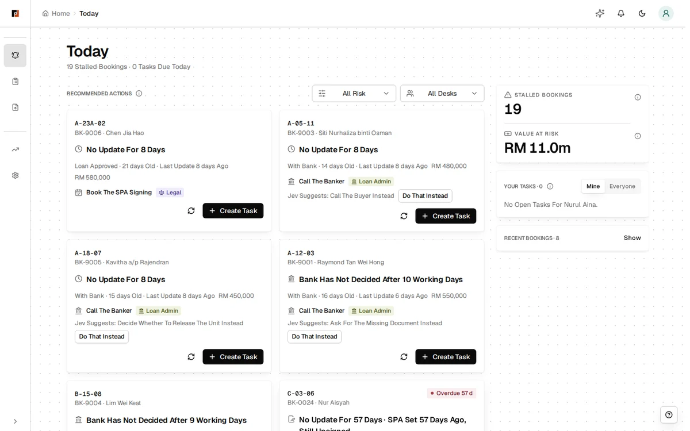
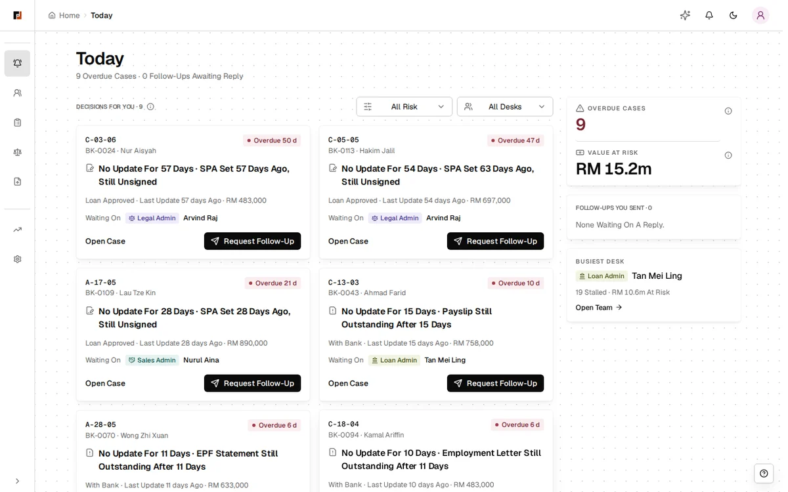
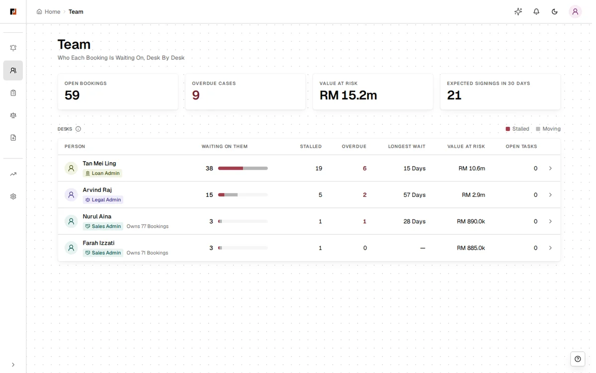
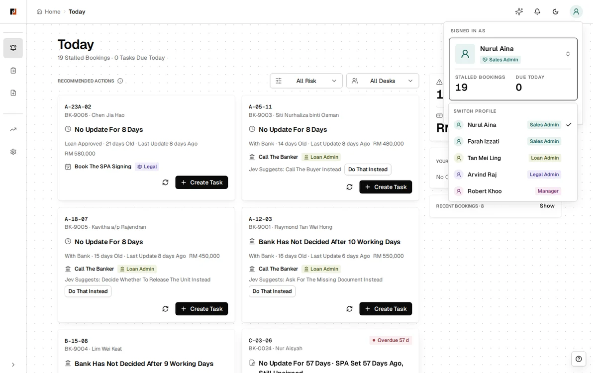

<a id="readme-top"></a>

<br />
<div align="center">
  

  <h3>Mortar</h3>

  <p>
    <b>Know which bookings will really become sales.</b><br />
    One live view of every booking across Sales, Loan Admin and Legal — the
    daily Today queue for the stuck ones, and a cash forecast that only counts
    bookings likely to sign.
  </p>

[![TypeScript][TypeScript-badge]][TypeScript-url]
[![React][React-badge]][React-url] [![Vite][Vite-badge]][Vite-url]
[![Bun][Bun-badge]][Bun-url] [![Tailwind][Tailwind-badge]][Tailwind-url]
[![shadcn/ui][shadcn-badge]][shadcn-url]
[![Recharts][Recharts-badge]][Recharts-url]
[![Vitest][Vitest-badge]][Vitest-url] [![MIT][MIT-badge]][LICENSE]

<a href="https://mortar-d18f.onrender.com"><strong>Live Demo »</strong></a>
&middot;
<a href="https://github.com/NexTechnologies-MY/Mortar/issues/new/choose">Report
A Bug</a> &middot;
<a href="https://github.com/NexTechnologies-MY/Mortar/issues/new/choose">Request
A Feature</a> <br />
</div>

## Table of Contents

<details>
  <summary>Expand</summary>
  <ol>
    <li>
      <a href="#about-the-project">About The Project</a>
      <ul>
        <li><a href="#screenshots">Screenshots</a></li>
        <li><a href="#how-it-works">How It Works</a></li>
        <li><a href="#features">Features</a></li>
        <li><a href="#architecture">Architecture</a></li>
        <li><a href="#tech-stack">Tech Stack</a></li>
      </ul>
    </li>
    <li>
      <a href="#getting-started">Getting Started</a>
      <ul>
        <li><a href="#prerequisites">Prerequisites</a></li>
        <li><a href="#installation">Installation</a></li>
        <li><a href="#run-jev-locally">Run Jev Locally</a></li>
        <li><a href="#ask-mortarai-mortarais-gemini-engine">Ask MortarAI</a></li>
        <li><a href="#test-database">Test Database</a></li>
        <li><a href="#project-structure">Project Structure</a></li>
      </ul>
    </li>
    <li>
      <a href="#faq">FAQ</a>
      <ul>
        <li><a href="#problem-and-solution">Problem And Solution</a></li>
        <li><a href="#ai-and-infrastructure">AI And Infrastructure</a></li>
        <li><a href="#user-feedback-and-testing">User Feedback And Testing</a></li>
        <li><a href="#hard-problems-we-solved">Hard Problems We Solved</a></li>
        <li><a href="#how-we-measure-success">How We Measure Success</a></li>
        <li><a href="#scaling-plans">Scaling Plans</a></li>
      </ul>
    </li>
    <li><a href="#roadmap">Roadmap</a></li>
    <li><a href="#team">Team</a></li>
    <li><a href="#license">License</a></li>
    <li><a href="#acknowledgments">Acknowledgments</a></li>
  </ol>
</details>

## About The Project

A property project launches, Sales books units in the first month, and the
launch is reported as a success. But a meaningful share of those bookings never
reaches a signed Sale & Purchase Agreement (SPA): loans are rejected, buyers
withdraw, paperwork stalls, or the case sits with a panel banker and quietly
dies.

Each booking can hold a unit off the market for six to twelve weeks while it
consumes marketing spend, agent commission accruals, and legal panel time.
Nobody can say, for a live project, how many booked units are likely to convert
— and the developer's cash flow forecast is built on bookings.

**Illustrative only:** 200 launch bookings at RM600k with 20% never converting
is RM24M of reported sales that is not real.

Built by **NexTechnologies** for the YEI 3.0 Youth Innovation Sandbox by Kabel
(Premium track), tackling the Chin Hin Group property booking conversion
challenge. Proposal PDF and pitch video are due Sunday, 20 September 2026.

Read next: [Design Spec](DESIGN.md) ·
[Problem Statement](source/problem-statement.md) ·
[Interview](source/interview.md) · [AGENTS](../AGENTS.md) ·
[Product Overview](PRODUCT.md) · [Product Requirements](PRD.md) ·
[Technical Requirements](TRD.md)

<p align="right"><a href="#readme-top">&uarr;</a></p>

---

### Screenshots

Every shot below is the running app on the seeded demo dataset. The data is
simulated; the screens are not mockups.

<table>
  <tr>
    <td width="33%">
      
      <br /><strong>Landing</strong>
      <br />The public entry point: the claim, and how the three desks fit together.
    </td>
    <td width="33%">
      
      <br /><strong>Today · Sales Admin</strong>
      <br />Nurul Aina's daily desk. Stalled bookings first, each with the rule-based next step, beside a rail of figures and tasks.
    </td>
    <td width="33%">
      
      <br /><strong>Today · Manager</strong>
      <br />Robert Khoo's desk: the overdue cases nobody has followed up yet, drawn as the same chase cards.
    </td>
  </tr>
  <tr>
    <td width="33%">
      
      <br /><strong>Team</strong>
      <br />One row per staff profile: who is holding bookings up, how long, and what that wait is worth.
    </td>
    <td width="33%">
      
      <br /><strong>Profile Menu</strong>
      <br />The avatar carries the signed-in persona and its two figures; it opens the five demo profiles.
    </td>
    <td width="33%">
      
      <br /><strong>Bookings</strong>
      <br />Loan Admin's desk. Every booking with age, stage, who it is waiting on, and financing risk.
    </td>
  </tr>
  <tr>
    <td width="33%">
      
      <br /><strong>Case Page</strong>
      <br />One booking end to end: loan and legal tracks, Waiting On and next move, messages, tasks and evidence.
    </td>
    <td width="33%">
      
      <br /><strong>Legal</strong>
      <br />What sits between an approved loan and a signed SPA, with whom, and for how long.
    </td>
    <td width="33%">
      
      <br /><strong>Forecast</strong>
      <br />Expected signings inside 30 days, with stage conversion rates, over a stack of the documents behind the figure.
    </td>
  </tr>
  <tr>
    <td width="33%">
      
      <br /><strong>Add Bookings</strong>
      <br />Upload a booking sheet or type them in, review row by row, and send to the main desks.
    </td>
    <td width="33%">
      
      <br /><strong>Settings</strong>
      <br />The demo dataset: seed, reference date, record counts, and a reset.
    </td>
    <td width="33%">
      
      <br /><strong>Jev Proposal</strong>
      <br />Jev reads each message and proposes an update. Staff confirm, dispute or dismiss.
    </td>
  </tr>
</table>

<p align="right"><a href="#readme-top">&uarr;</a></p>

---

### How It Works

The funnel runs from booking fee to bank disbursement:

1.  Booking (small fee)
1.  Loan application(s), often several banks at once
1.  Letter of Offer
1.  SPA signed (buyer pays 10%)
1.  Loan agreement (panel solicitor)
1.  Bank disburses progressively

Sales, Credit/Loan Admin and Legal each hold one slice of that funnel and no
existing tool shows the whole. Mortar's input is the booking spreadsheet the
team already maintains — intake, not migration — and its rules push the daily
Today queue instead of waiting for somebody to open a report.

The app is used as four personas, switched from the profile menu in the header
and persisted in `localStorage` under `mortar.profile` (with `mortar.persona`
still written alongside it). Five named demo profiles sit behind the four
personas: two Sales Admins, one Loan Admin, one Legal Admin and one Manager.

| Persona     | Home Route  | Job                                                        |
| ----------- | ----------- | ---------------------------------------------------------- |
| Sales Admin | `/chase`    | Works the Today queue of stuck bookings                    |
| Loan Admin  | `/bookings` | Tracks loan and banker status across bookings              |
| Legal Admin | `/legal`    | Works the queue of unsigned SPAs by how long they have sat |
| Manager     | `/chase`    | Works Decisions For You: the overdue cases, then escalates |

| Route           | Purpose                                                                                                                              |
| --------------- | ------------------------------------------------------------------------------------------------------------------------------------ |
| `/`             | Public landing page                                                                                                                  |
| `/sign-in`      | Named demo profile picker and signed session cookie, no password                                                                     |
| `/app`          | Redirects to the active persona's home                                                                                               |
| `/chase`        | Today: who to chase today, with rule-based next steps, blocker reasons, and WhatsApp click-to-chat links                             |
| `/team`         | Team: every desk's load side by side, most overdue first, with Open Bookings, Overdue Cases, Value At Risk and Expected Signings     |
| `/bookings`     | Bookings: unit pipeline, Who Holds Each Booking filter, and side sheet quick view; hand-entry Add Booking and closed Excel export    |
| `/bookings/:id` | Case page: single-sentence status header, dual tracks, button-driven updates, and verbal Jev readings                                |
| `/legal`        | Legal: SPA execution queue with No Appointment Yet and Appointment Set, Not Signed sections, with inline appointment/signing dialogs |
| `/forecast`     | Forecast: projected signings, accuracy score sentence, the supporting document stack, and where bookings died                        |
| `/import`       | Add Bookings: upload a spreadsheet or type bookings in directly, with row-by-row review                                              |
| `/faq`          | FAQ                                                                                                                                  |
| `/settings`     | Settings: demo dataset controls, reset, server health, and folded layouts                                                            |

<p align="right"><a href="#readme-top">&uarr;</a></p>

---

### Features

**A booking is never counted as cash at face value.**

Every booking enters the forecast at the historical conversion rate of its
current stage — enforced in `@mortar/core`, not in a dashboard label somebody
could forget to apply. The consequences are worn openly:

- The forecast can only move toward honesty as evidence arrives; a stalled
  booking drags the number down instead of inflating it
- Success is one number, readable within a quarter: the percentage of bookings
  that sign the SPA within 30 days — a cash outcome, not a dashboard
- Every booking is screened within 48 hours; the salvageable get chased and
  doomed units are released early, rather than blocking bookings upstream with
  stricter pre-qualification

Every persona lands on the same Today. The desk colours mark the role and the
avatar, never a status, and the top bar carries only a silhouette avatar, so the
signed-in profile, its figures and the switcher live in one popover.

Measured, not estimated.

|                               |        |
| ----------------------------- | ------ |
| App pages                     | **12** |
| API routes                    | **15** |
| Personas                      | **4**  |
| Demo profiles                 | **5**  |
| Funnel stages tracked         | **6**  |
| Shared packages               | **2**  |
| Backend services              | **1**  |
| Real buyer records in the app | **0**  |

The shell, routes, and profile menu are built and deployed, and the screens walk
the primary flows on seeded bookings. The `@mortar/core` domain rules — stage
tracking, risk flags, Today queue, risk-weighted forecast — are in place behind
a Bun API reading Postgres.

<p align="right"><a href="#readme-top">&uarr;</a></p>

---

### Architecture

One deployable and two shared libraries. A single Bun process serves `/api/*`
and the built frontend, bookings live in Postgres, and the domain rules stay
pure TypeScript in `@mortar/core`.

<picture>
  <source media="(prefers-color-scheme: dark)" srcset="assets/architecture-dark.svg">
  
</picture>

<details>
  <summary>Text version</summary>

```text
Browser — React 19 SPA
  SnapshotProvider derives every view through @mortar/core
        |
        |  GET /api/snapshot  ·  POST /api/* writes
        v
Render web service (Singapore)
        |
        v
Bun.serve — one process, server/src/index.ts
  frontend/dist + SPA fallback  ·  /api/* (15 routes)
        |
        |             @mortar/jev ──> TypeSafe Jev (jev-latest)
        |             key stays server-side, cache-first
        v
Neon PostgreSQL — Bun native SQL, pooled
  bookings · loan_applications · events · messages
  tasks · playbooks · jev_answers · meta

@mortar/core is imported by the browser and the server alike,
so a booking has one definition and never two.
```

</details>

| Piece            | Runs                     | Job                                                       |
| ---------------- | ------------------------ | --------------------------------------------------------- |
| `frontend/`      | Built to `frontend/dist` | React 19 + Vite SPA, served by the Bun process            |
| `server/`        | Render                   | `Bun.serve`: static assets, `/api/*`, SQL schema on boot  |
| `packages/core/` | Browser and server       | `@mortar/core`: contract types, domain rules, forecasting |
| `packages/jev/`  | Server only              | `@mortar/jev`: TypeSafe Jev client, questions, fallbacks  |
| `docs/`          | Repo                     | This file, the design spec, sources, agent notes          |

Every push to `main` deploys automatically to Render, in Singapore, once its CI
checks pass.

<p align="right"><a href="#readme-top">&uarr;</a></p>

---

### Tech Stack

[![TypeScript][TypeScript-badge]][TypeScript-url]
[![React][React-badge]][React-url] [![Vite][Vite-badge]][Vite-url]
[![Bun][Bun-badge]][Bun-url] [![Tailwind][Tailwind-badge]][Tailwind-url]
[![shadcn/ui][shadcn-badge]][shadcn-url]
[![Recharts][Recharts-badge]][Recharts-url]
[![Vitest][Vitest-badge]][Vitest-url] [![MIT][MIT-badge]][LICENSE]

| Layer    | Choice                                                     |
| -------- | ---------------------------------------------------------- |
| Frontend | React 19, react-router 7, Vite 6, TypeScript               |
| Backend  | Bun HTTP server, `@mortar/core` and `@mortar/jev`          |
| Database | Postgres, schema and seed applied on first boot            |
| Tooling  | Bun 1.3.14 workspaces (`frontend`, `packages/*`, `server`) |
| Styling  | Tailwind CSS 4, shadcn/ui (Radix)                          |
| Charts   | Recharts 3                                                 |
| State    | React Context for persona; case data from `/api`           |
| Tests    | Vitest, Testing Library, jsdom                             |
| Serving  | One Bun process serves `/api/*` and `frontend/dist`        |
| AI       | MortarAI: Jev (TypeSafe SDK) and Gemini (`assistant/`)     |
| Hosting  | Render web service, Free instance (Singapore)              |

<p align="right"><a href="#readme-top">&uarr;</a></p>

---

## Getting Started

The app needs Postgres. Copy `.env.example` to `.env` at the repo root and set
`DATABASE_URL`; an empty database is fine, because the server applies the schema
and seeds the canonical dataset on first boot.

<p align="right"><a href="#readme-top">&uarr;</a></p>

### Prerequisites

- [Bun 1.3.14](https://bun.sh/), pinned by `packageManager` in `package.json`
- Postgres 17
- A modern desktop browser

<p align="right"><a href="#readme-top">&uarr;</a></p>

### Installation

1.  Clone the repository.

    ```sh
    git clone https://github.com/NexTechnologies-MY/Mortar.git
    cd Mortar
    ```

1.  Start Postgres, and copy `.env.example` to `.env` at the repo root with
    `DATABASE_URL` pointing at it.

    ```sh
    docker run -d --name mortar-pg -e POSTGRES_PASSWORD=mortar \
      -e POSTGRES_DB=mortar -p 5432:5432 postgres:17-alpine
    ```

1.  Install the workspaces and start the app.

    ```sh
    bun install
    bun run dev        # frontend :5173, API :8787
    ```

```sh
bun run dev        # Start the Bun API and the Vite dev server together
bun run check      # Lint, typecheck, and test across workspaces
bun run format     # Prettier formatting across the repository
bun run build      # tsc -b && vite build → frontend/dist/
bun run db:reset   # Re-seed the database deterministically
```

<p align="right"><a href="#readme-top">&uarr;</a></p>

### Run Jev Locally

Without `TYPESAFE_API_KEY` set, Jev serves only precomputed answers. Setting
`JEV_PROXY_URL` (with `TYPESAFE_API_KEY` still unset) points Jev at a local
Anthropic-Messages-compatible model proxy, such as CLIProxyAPI, instead, so
Jev's live path can be exercised without a TypeSafe key.

```sh
JEV_PROXY_URL=http://127.0.0.1:PORT     # base URL, no trailing /v1/messages
JEV_PROXY_KEY=                          # the proxy's x-api-key
JEV_PROXY_MODEL=gemini-3.5-flash-lite   # model to route to (default shown)
```

**Warning:** case data is sent as a prompt to whatever model sits behind the
proxy. Use this only with made-up demo data, never with real buyer or booking
information.

<p align="right"><a href="#readme-top">&uarr;</a></p>

### Ask MortarAI (MortarAI's Gemini Engine)

MortarAI is Mortar's AI layer: Jev classifies messages, and Gemini answers staff
questions in Ask MortarAI. Ask MortarAI connects to Google's Gemini API over
`fetch` (`POST /api/assistant`) to answer questions grounded in the live
snapshot using five read-only tools. Set `GEMINI_API_KEY` in `.env` to enable
it:

```sh
GEMINI_API_KEY=                         # Google Gemini API key
GEMINI_MODEL=gemini-3.5-flash-lite      # Optional model (default shown)
```

Without a key, the endpoint returns 503 and the UI falls back to scripted
answers. **Data caveat:** On Gemini's free tier, prompts and answers may be used
by Google to improve products; use only with simulated demo data. Real buyer
data requires a paid tier or Vertex AI under a PDPA data processing agreement.

<p align="right"><a href="#readme-top">&uarr;</a></p>

### Test Database

The database integration test suite (`server/db/__tests__/integration.test.ts`)
reads `TEST_DATABASE_URL`:

```sh
TEST_DATABASE_URL=postgres://...        # Dedicated test Postgres connection
```

Tests skip when unset and never read `DATABASE_URL`, which often points at
production. The suite seeds an empty test database once on first boot and cleans
up its test rows. Never point `TEST_DATABASE_URL` at production. The team test
database is the separate Neon project `mortar-test`.

<p align="right"><a href="#readme-top">&uarr;</a></p>

### Project Structure

```text
docs/            This file, DESIGN.md, sources, agent notes
frontend/        The app: React 19 + Vite SPA
  src/pages/     One file per route
  src/components/layout/, ui/ (shadcn), charts/
  src/lib/       Persona context, stores, formatters
packages/core/   @mortar/core: shared TypeScript domain rules
packages/jev/    @mortar/jev: proposals, playbooks, answer cache
server/          Bun API over Postgres; also serves frontend/dist
  db/            Schema, seed, and row mappers
  src/           Routes, Jev cache, static handler, assistant/
.github/         CI workflow, contributor guide and templates
Dockerfile       Bun build → Bun alpine runtime
AGENTS.md        Agent instructions: stack, routes, rules
```

<p align="right"><a href="#readme-top">&uarr;</a></p>

---

## FAQ

Short answers about how Mortar fits the booking-to-SPA problem, how it is built
and tested, and where it goes next.

<p align="right"><a href="#readme-top">&uarr;</a></p>

### Problem And Solution

The challenge asks how a developer can tell which bookings will really convert.
Mortar's answer is a single rule carried by the code, not by a label: a booking
is never counted as cash at face value.

- **The problem is real and expensive.** A booking holds a unit off the market
  for six to twelve weeks while marketing spend, agent commission accruals and
  legal panel time accrue. The Federal Court held in _PJD Regency_ (2021) that
  late-delivery damages run from the booking fee date, not the SPA date, and
  that case ran about 64 days — every stalled week counts.
- **Nobody can size it.** In our practitioner survey (n = 8), seven named loan
  rejection or financing failure as the single largest cause of leakage and all
  eight ranked it in the top three. Half said only 0 to 2 of every 10 bookings
  reach a signed SPA. No public figure exists for Malaysian booking-to-SPA
  conversion, so the size of the leakage is exactly what nobody can see.
- **The solution is a queue, not a gate.** Mortar does not tighten pre-sales
  qualification, which would damp launch momentum. It puts every stalled booking
  in a daily Today queue with the blocker in words, who holds it and the one
  next move, so salvageable cases are chased and doomed units are released
  early.
- **The forecast follows the evidence.** Every booking enters the 30-day
  forecast at the historical conversion rate of its current stage and age
  bucket, so the number can only move toward honesty as evidence arrives.

**Illustrative only:** 200 launch bookings at RM600k with 20% never converting
is RM24M of reported sales that is not real.

Mortar is not a CRM, not a customer-facing portal, and not an autonomous
decider. It takes bookings after a deposit is paid, and every milestone is
confirmed by a named person.

<p align="right"><a href="#readme-top">&uarr;</a></p>

### AI And Infrastructure

MortarAI is Mortar's AI layer and has two engines. Jev classifies messages, and
Gemini answers in Ask MortarAI. Neither ever writes to a record or makes a
credit, loan, or legal decision.

- **Jev classifies, it does not generate.** `@mortar/jev` runs TypeSafe
  server-side (`jev-latest`) and returns typed objects — a choice over the event
  class, the document kind and the owner, plus scored probabilities. It never
  produces free text. The TypeSafe key stays on the server and is never sent to
  the browser.
- **Every reading is a proposal.** Staff confirm, dispute or dismiss it, and
  only a confirmed event advances a case. Below 0.60 confidence the case is
  flagged for review.
- **The demo survives a Jev outage.** Live calls time out at 3,000ms and fall
  back to an exact cache hit, then to the latest cached answer for that subject
  marked stale, then to neutral structural answers. GET routes are cache-first
  and page navigation never waits on a model.
- **Ask MortarAI is read-only.** `POST /api/assistant` calls Gemini over `fetch`
  and grounds every answer in five read-only tools over the live snapshot
  (`find_bookings`, `get_case`, `get_my_queue`, `get_forecast_summary`,
  `search_playbooks`). Message bodies reach the model fenced as untrusted data,
  citations link only to cases a tool returned, and without a key the endpoint
  returns 503 and the UI falls back to scripted answers.

Infrastructure follows from the same boundaries:

- **One process, no reverse proxy.** A single Bun process on a Render web
  service in Singapore serves `frontend/dist` with SPA fallbacks and all
  `/api/*` routes. The schema is applied on boot.
- **One database.** Neon PostgreSQL, reached through pooled connections on Bun's
  native SQL client. Local development targets the `dev` branch, production the
  `main` branch.
- **One definition of a booking.** `@mortar/core` is pure TypeScript with no DOM
  or Node dependencies, imported by the browser and the server alike, so the
  frontend derives every view from one snapshot rather than trusting a second
  copy of the rules.
- **One deploy path.** Render builds the root `Dockerfile` and deploys every
  push to `main` once GitHub Actions passes. Secrets are set in the Render
  dashboard and never pass through GitHub.

<p align="right"><a href="#readme-top">&uarr;</a></p>

### User Feedback And Testing

The developer's staff have not used Mortar yet. It runs on a synthetic dataset
on seeded bookings, so there is no real-user feedback or production conversion
figure to report, and we do not invent one. What we test instead:

- **Determinism.** The same seed produces identical bookings, applications and
  event sequences across environments, and no generated event is dated after the
  reference date. The maths is checked against known values: the Wilson score
  interval for 5 of 10 is asserted exactly, and instalments against amortisation
  tables.
- **The forecast is audited against itself.** A backtest cuts the event log 30
  days before the reference date, forecasts the bookings live at that moment,
  then observes what actually happened, and reports predicted against observed
  signings, a Brier score and a calibration table.
- **The database suite never touches production.** It reads `TEST_DATABASE_URL`
  only, skips cleanly when unset, and proves that adding demo data is idempotent
  and that deleting it removes only the demo rows.
- **The failure paths are tested, not assumed.** Recorded TypeSafe fixtures
  drive the Jev client tests, and the fallback ladder is exercised against
  timeouts and provider errors.
- **The assistant boundary is tested.** The Gemini tools, the read-only rule,
  the fencing of untrusted message bodies and the fallback when the key is
  missing all have tests.
- **Anyone can try it.** The live demo carries five named profiles, one per
  persona and one second Sales Admin, and Settings can reset the dataset exactly
  as shipped, so the next visitor starts clean.

The feedback loop for a pilot is already built in. Every confirmed, disputed and
dismissed proposal records who made it and when, and every task records its
owner and outcome. Those overrides, with queue age and how often a stalled case
really needed a person, are what would recalibrate the stall rules — which must
happen before any production use.

<p align="right"><a href="#readme-top">&uarr;</a></p>

### Hard Problems We Solved

- **Refusing to count bookings as cash.** The rule lives in `@mortar/core` and
  is enforced on the forecast, not printed on a dashboard somebody could forget
  to apply. Nothing in the UI shows a score or a probability.
- **Rounding a number nobody can see.** Booking-to-SPA conversion is unpublished
  in Malaysia, so the forecast reports what it can defend: stage and age-bucket
  rates, Wilson 95% confidence intervals, and a 10th-to-90th percentile range
  from 2,000 seeded Monte Carlo draws. A stage-age group with fewer than eight
  resolved cases falls back to the stage rate, and then to the dataset rate,
  rather than quoting a thin sample as fact.
- **An AI that must never be the decider.** Every model answer is a proposal
  that a named person confirms, disputes or dismisses; a low-confidence reading
  is flagged rather than applied; and a provider outage degrades to cached or
  neutral answers instead of inventing one.
- **Not knowing is not knowing.** A live booking with no confirmed event for ten
  days shows as unknown, so a silent case can never masquerade as a healthy
  pipeline.
- **One bank failing is not a dead booking.** Loan and legal run as independent
  tracks, and a booking can carry up to three bank applications at once, so one
  rejection does not mark a multi-application case as failed.
- **Throwing away precision we do not have.** Where bookings die is ranked in a
  stated root-cause order, the recoverable share is measured over resolved cases
  only and shown with its sample size and interval, and the arithmetic behind it
  is on screen.

And the limits we hold open:

- **Synthetic data only.** The prototype ships invented bookings; no real buyer
  data is touched.
- **No integrations.** No bank, solicitor, or CRM connections — the spreadsheet
  is the only input, and case status arrives via the people who chase it.
- **Survey evidence.** The leakage ranking rests on an anonymous survey of eight
  Malaysian industry practitioners (n = 8).
- **PDPA.** Real buyer documents are personal data under Malaysia's PDPA and
  stay out of free-tier AI APIs (such as Gemini's free tier).
- **Demo profile sign-in.** Sign-in selects a named demo profile with a signed
  session cookie, but uses no passwords or real authentication. Only made-up
  buyers should be imported; income figures still reach the browser because risk
  is worked out there.
- **AI is an assistant, not a decider.** Rules flag risk; MortarAI's Jev engine
  structures messages and its Gemini engine answers grounded inquiries in Ask
  MortarAI, but neither ever writes to records or makes credit, loan, or legal
  decisions.

<p align="right"><a href="#readme-top">&uarr;</a></p>

### How We Measure Success

Mortar avoids vanity engagement metrics such as dashboard views, login counts,
or generated AI tokens. Success is one business number readable within a single
operating quarter.

**30-day verified SPA rate** = bookings that sign a verified SPA within 30 days
of booking, divided by all eligible bookings in the cohort. A booking signing on
day 31 is a conversion miss, and verification means an executed agreement
confirmed by the legal panel, not a verbal report.

Alongside it, the operational measures the pilot will set baselines for:

| Metric                   | Measurement Method                                                                | Target Objective                          |
| ------------------------ | --------------------------------------------------------------------------------- | ----------------------------------------- |
| Stalled Booking Recovery | Count of stalled bookings transitioned to active stage following task completion  | Set from the pilot baseline               |
| Case Dwell In Unknown    | Average calendar days bookings remain in `unknown: true` status                   | Set from the pilot baseline               |
| Forecast Calibration     | Brier score comparing case probabilities against observed 30-day outcomes         | Reported, not targeted, on simulated data |
| AI Extraction Accuracy   | Proportion of Jev proposals confirmed by staff without modification or dispute    | Set from the pilot baseline               |
| Live Jev Latency         | End-to-end network roundtrip time for live message extraction                     | Under 3 seconds in the demo               |
| Fallback Cache Hit Rate  | Percentage of demo requests successfully served from cache during network latency | Every demo step has a cached answer       |

We publish no conversion figure today, because the data is simulated. The
forecast's accuracy sentence and its backtest are labelled as what they are: a
backtest on simulated data proves the method, not the business.

<p align="right"><a href="#readme-top">&uarr;</a></p>

### Scaling Plans

Today's build is sized for a prototype on one project and synthetic data. The
choices that already carry further:

- **Durable state lives outside the container,** in Postgres, so capacity grows
  by raising the instance cap rather than by rewriting storage.
- **One definition of a booking** in `@mortar/core`, imported by both tiers, so
  the browser and the server can never disagree about a case.
- **The demo never depends on a model being up,** because every read is
  cache-first and every answer has a documented fallback.

The production path, in order:

1.  **Calibrate the engine** against historical developer ERP data, and
    reconcile a sample of closed cases.
2.  **Ingest for real.** Replace spreadsheet intake with bidirectional ERP
    integration (such as IFCA) and OCR ingestion for scanned pay slips.
3.  **Integrate the outside parties** that Mortar deliberately does not depend
    on today: a WhatsApp Business Cloud API webhook, authenticated connectors
    and SSO with role-based access control.
4.  **Earn real documents.** Approve retention, access, transfer and provider
    controls before a single production document is processed.

Then the 12-week on-site pilot, designed to read its effect within one quarter:
ingest and baseline in weeks 1–2, run the daily queue with one administrator and
introduce Jev extraction where it removes a demonstrated burden in weeks 3–4,
enroll a live cohort and record actions and outcomes in weeks 5–8, and close the
30-day window, audit executed SPAs with Legal and decide on broader rollout in
weeks 9–12.

Two constraints bind all of it. Transaction records are kept 7 years (Companies
Act 2016 s245, Income Tax Act 1967 s82), so a server holding real data must set
`MORTAR_DEMO_RESET=off` — see [Data Retention](TRD.md#data-retention). And real
buyer data requires a paid tier or Vertex AI under a PDPA data processing
agreement, because on Gemini's free tier prompts and answers may be used to
improve Google's products.

<p align="right"><a href="#readme-top">&uarr;</a></p>

---

## Roadmap

- [ ] WhatsApp chase, replacing click-to-chat links with a synced thread
- [ ] Better Auth, replacing the demo profile picker with real authentication
- [ ] Document storage, so buyer documents stop arriving as pasted text

<p align="right"><a href="#readme-top">&uarr;</a></p>

---

## Team

Built by **NexTechnologies**.

<p align="center">
  <a href="https://github.com/AlaskanTuna"></a>
  <a href="https://github.com/Andersonnn7788"></a>
  <a href="https://github.com/DrxgClanPC"></a>
  <a href="https://github.com/chaosiris"></a>
</p>

<p align="center">
  <a href="https://github.com/AlaskanTuna"><sub>@AlaskanTuna</sub></a>
  &middot;
  <a href="https://github.com/Andersonnn7788"><sub>@Andersonnn7788</sub></a>
  &middot;
  <a href="https://github.com/DrxgClanPC"><sub>@DrxgClanPC</sub></a>
  &middot;
  <a href="https://github.com/chaosiris"><sub>@chaosiris</sub></a>
</p>

<p align="right"><a href="#readme-top">&uarr;</a></p>

---

## License

Released under the [MIT License](../LICENSE).

<p align="right"><a href="#readme-top">&uarr;</a></p>

---

## Acknowledgments

- The YEI 3.0 Youth Innovation Sandbox by [Kabel](https://kabel.my) and
  [Chin Hin Group](https://chinhin.com/), for the challenge and the sponsor
- [shadcn/ui](https://ui.shadcn.com/), [Radix UI](https://www.radix-ui.com/),
  and [Lucide](https://lucide.dev/)
- [TypeSafe](https://docs.typesafe.ai/) and
  [Google Gemini](https://ai.google.dev/), for MortarAI's two engines
- Everyone who answered the anonymous practitioner survey behind the leakage
  ranking

<p align="right"><a href="#readme-top">&uarr;</a></p>

[TypeScript-badge]:
  https://img.shields.io/badge/TypeScript_Strict-3178C6?style=for-the-badge&logo=typescript&logoColor=white
[TypeScript-url]: https://www.typescriptlang.org/
[React-badge]:
  https://img.shields.io/badge/React_19-20232A?style=for-the-badge&logo=react&logoColor=61DAFB
[React-url]: https://react.dev/
[Vite-badge]:
  https://img.shields.io/badge/Vite_6-646CFF?style=for-the-badge&logo=vite&logoColor=white
[Vite-url]: https://vite.dev/
[Bun-badge]:
  https://img.shields.io/badge/Bun_1.3.14-000000?style=for-the-badge&logo=bun&logoColor=white
[Bun-url]: https://bun.sh/
[Tailwind-badge]:
  https://img.shields.io/badge/Tailwind_CSS_4-06B6D4?style=for-the-badge&logo=tailwindcss&logoColor=white
[Tailwind-url]: https://tailwindcss.com/
[shadcn-badge]:
  https://img.shields.io/badge/shadcn%2Fui-000000?style=for-the-badge&logo=shadcnui&logoColor=white
[shadcn-url]: https://ui.shadcn.com/
[Recharts-badge]:
  https://img.shields.io/badge/Recharts_3-FF6384?style=for-the-badge
[Recharts-url]: https://recharts.org/
[Vitest-badge]:
  https://img.shields.io/badge/Vitest_3-6E9F18?style=for-the-badge&logo=vitest&logoColor=white
[Vitest-url]: https://vitest.dev/
[MIT-badge]: https://img.shields.io/badge/License-MIT-yellow?style=for-the-badge
