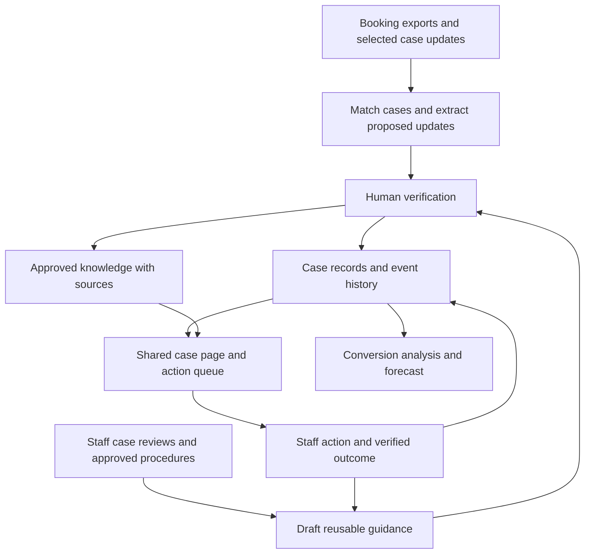

# A Company Brain For Booking-To-SPA Conversion

Research and platform concept for Chin Hin Group, Malaysia. Research date: 19
September 2026.

## Recommendation

Build a shared booking workspace with three connected capabilities: **a reliable
case record, searchable staff knowledge, and follow-up actions with owners**. A
company brain can supply the knowledge capability. The business benefit comes
when that knowledge changes what happens to a live booking.

Start with one project and one Sales Administration Executive. Use exports from
the existing booking system, selected case communications and verified legal
updates. Add a knowledge tool only where it makes this daily work easier. A
company-wide rollout and a sophisticated knowledge graph can follow evidence
that the small version helps bookings convert.

This document is a researched proposal, not a tested deployment. No Chin Hin
internal records were available. The company’s systems, access rights, leakage
rates and leading causes remain to be established. Product descriptions below
come from primary project documentation; the fit assessments are my judgment.

The first Mortar prototype simulates this concept in the browser on synthetic
data. [Front-End Simulation](simulation.md) sets its scope and seed values.

## 1. What A Central Company Brain Should Mean Here

Your intuition about preserving experienced staff members’ knowledge is useful.
However, there are several kinds of information to preserve, with different
reliability requirements.

| Layer               | Example                                                     | How The Platform Should Handle It                             |
| ------------------- | ----------------------------------------------------------- | ------------------------------------------------------------- |
| Current case facts  | Application submitted; documents outstanding; SPA executed  | Structured records, dated evidence and a responsible verifier |
| Staff experience    | Which questions reveal an avoidable document problem        | Searchable case examples and reviewed guidance                |
| Formal requirements | A current document checklist or approved internal procedure | Versioned source, owner and review date                       |
| Work in progress    | Someone must obtain a missing statement by Thursday         | Task, owner, due date and completion evidence                 |
| Estimates           | Likelihood of signing the SPA within 30 days of booking     | A measured method, stated horizon and uncertainty             |

The shared platform should answer four practical questions:

1. What is happening with this booking, and what evidence supports that answer?
2. What is blocking progress, and what information is missing?
3. What should the responsible person do next, using relevant experience?
4. Did that action lead to an executed SPA or another verified outcome?

“Central” means a consistent place to find permitted information. Sales may need
to know that income documents are incomplete without seeing the buyer’s full
bank statements. Some records can remain in their original systems, with links
and permission-controlled summaries in the workspace.

## 2. Open-Source Projects Worth Learning From

These projects occupy different parts of the solution. They are alternatives to
evaluate, not a list to install together. Licence labels refer to the
repositories reviewed on the research date; hosted products and enterprise
features can have different terms.

| Project And Primary Source                       | What It Provides                                                                                                  | Fit For This Problem                                                                                                    | Licence And Boundary                                                                                                                                                                                                            |
| ------------------------------------------------ | ----------------------------------------------------------------------------------------------------------------- | ----------------------------------------------------------------------------------------------------------------------- | ------------------------------------------------------------------------------------------------------------------------------------------------------------------------------------------------------------------------------- |
| [GBrain](https://github.com/garrytan/gbrain)     | Persistent agent memory with sources, retrieval and knowledge relationships                                       | A useful foundation for preserving approved experience and giving assistants shared context                             | MIT. The booking model, department workflow and business verification still need to be built. A shared company brain needs Postgres or Supabase, an HTTPS MCP server and OAuth clients.                                         |
| [Onyx](https://github.com/onyx-dot-app/onyx)     | A user-facing AI platform with chat, document retrieval and connectors                                            | A strong candidate to evaluate when the first need is staff searching internal knowledge through a ready-made interface | Code outside the `ee/` directories is MIT; enterprise features sit in the same repository under the separate Onyx Enterprise License. Verify which permission and administration features the chosen edition supplies.          |
| [RAGFlow](https://github.com/infiniflow/ragflow) | Document ingestion and retrieval, including complex documents and scanned material, with citations                | Worth evaluating if retrieving information from PDFs and scans is the main difficulty                                   | Apache-2.0. It still needs a structured booking record and task workflow. Its documented self-hosting baseline includes at least 16 GB RAM.                                                                                     |
| [Cognee](https://github.com/topoteretes/cognee)  | An agent-memory platform that organizes information into a searchable knowledge graph                             | A candidate for a custom application whose assistants need persistent, connected knowledge                              | Apache-2.0. Budget for application development, source mapping and access-control integration.                                                                                                                                  |
| [Graphiti](https://github.com/getzep/graphiti)   | A framework for incrementally building knowledge graphs that represent changing relationships and facts over time | Particularly relevant if knowing what was true at a particular time becomes essential                                   | Apache-2.0. A developer component, not a finished departmental workspace; distinct from Zep’s managed commercial service. Needs Neo4j or FalkorDB.                                                                              |
| [Khoj](https://github.com/khoj-ai/khoj)          | A self-hostable second-brain assistant with document search, custom agents and automations                        | Useful for learning about knowledge-assistant interactions and trying a small knowledge prototype                       | AGPL-3.0. Check licence obligations for the intended deployment and adaptation; do not assume personal-assistant features satisfy company access requirements. Development has slowed; the latest release is a March 2026 beta. |

Two supporting tools deserve separate consideration:

| Tool                                                  | Useful Role                                                                                                     | Important Distinction                                                                                                                                                                                                                                                                                                     |
| ----------------------------------------------------- | --------------------------------------------------------------------------------------------------------------- | ------------------------------------------------------------------------------------------------------------------------------------------------------------------------------------------------------------------------------------------------------------------------------------------------------------------------- |
| [Docling](https://github.com/docling-project/docling) | Converts documents into structured content, including OCR for scanned material, for a custom ingestion pipeline | A document-processing component rather than a company brain. Code is MIT; individual model licences should also be checked.                                                                                                                                                                                               |
| [Dify](https://github.com/langgenius/dify)            | A visual environment for building AI workflows, retrieval applications and tool integrations                    | Source-available under a modified Apache-based licence with additional conditions. Its [licence](https://github.com/langgenius/dify/blob/main/LICENSE) includes restrictions concerning multi-tenant operation and frontend branding; it should not be grouped unqualified with standard permissive open-source projects. |

### How I Would Narrow The Choice

**For learning about the company-brain idea, start with GBrain’s
[company-brain tutorial](https://github.com/garrytan/gbrain/blob/master/docs/tutorials/company-brain.md).**
It makes shared sources and per-user access concrete. One important detail: read
access is source-level; folders inside a shared source are not independent
confidentiality boundaries. This matters when separating common case status from
restricted buyer documents.

For the pilot, choose according to the bottleneck:

- **Knowledge Is Hard To Find:** evaluate Onyx as the knowledge interface
  alongside a small case tracker.
- **Scans Are Hard To Read And Search:** evaluate RAGFlow, or Docling inside a
  custom app.
- **You Want To Build Your Own Assistant And Interface:** evaluate GBrain or
  Cognee as the memory component.
- **Changing Relationships Are Difficult To Reconstruct:** evaluate Graphiti
  after the basic case records work.
- **Actions Are Forgotten Despite Adequate Information:** begin with a shared
  task queue and clear ownership. A new memory engine may add little initially.

My starting choice would be **a small structured case application plus
searchable, approved playbooks**. Add one of these knowledge backends after
trying the same small set of real, anonymized questions against it. Do not make
the pilot depend on deploying several AI platforms.

Self-hosting still consumes setup time, infrastructure and maintenance. For the
“no new vendor” constraint, use existing approved infrastructure and model
access, or a local model if practical. The basic case workflow should remain
usable without an AI service.

## 3. Overall Platform Concept

**Working Name:** Booking-to-SPA Workspace.

Each booking has one shared case page, backed by a history of events. The home
screen is a work queue: cases needing an action, evidence or a decision today.
Department-specific views show the same underlying cases.

| Team                          | Information It Contributes                                                               | What It Receives                                                                         |
| ----------------------------- | ---------------------------------------------------------------------------------------- | ---------------------------------------------------------------------------------------- |
| Sales                         | Buyer intention, contact attempts, concerns, agreed follow-up                            | A clear request to discuss with the buyer and visibility of financing and legal blockers |
| Credit / Loan Administration  | Applications, document completeness, banker acknowledgements, conditions and decisions   | Missing-item queues, dated commitments and comparable prior cases                        |
| Legal                         | File readiness, outstanding legal requirements, execution status and supporting evidence | Visibility of dependencies and cases ready for the next legal step                       |
| Sales Administration          | Identity matching, reconciled updates, task coordination and exceptions                  | One place to establish current status and pursue the next action                         |
| Finance, as a downstream user | Receipt verification and relevant payment milestones                                     | Expected conversion with uncertainty, separate from realized receipts                    |

### The Case Page

At minimum, show the booking ID, project, unit, booking date, responsible staff,
loan applications, legal milestones, latest verified updates, missing evidence,
next action and its owner.

Keep loan progress and legal progress as separate tracks: they can overlap. One
booking can have several bank applications. A rejected application does not by
itself mean the booking has failed. A cancelled booking followed by a new buyer
is a new booking linked to the same unit.

Each important update should retain:

- The original source or a permitted link to it.
- When the event happened and when the system learned about it.
- Who reported it and who verified it.
- Whether it is confirmed, provisional, disputed or superseded.

“No recent evidence” should be visible as an unknown status. It should not
silently become either “progressing” or “failed.”

### An Illustrative Day-To-Day Case

An administrator opens a booking aged 23 days. Sales says the buyer remains
interested. A banker’s message says an income document is missing. Legal says
its file is ready for the next step, subject to confirmation of outstanding
requirements.

The workspace brings these updates together and proposes:

> Current blocker: income document outstanding. Loan Administration to confirm
> the exact requirement; Sales to obtain it from the buyer. Review tomorrow.
> Evidence: banker message, dated yesterday.

An approved playbook explains how a similar document problem was handled and
when that approach is inappropriate. The administrator checks the proposed task,
assigns it and sends the request through the team’s existing channel. Subsequent
acknowledgement, decision and SPA execution are recorded as separate events.

The useful change is that a specific blockage reaches someone who can act on it,
with the necessary context.

## 4. How The Parts Connect

Three implementation choices keep this manageable:

1. **Structured records answer exact operational questions.** Counts, dates,
   overdue tasks and measured conversion rates come from database queries and
   explicit rules.
2. **Retrieved knowledge helps explain and suggest.** The assistant searches
   relevant sources before answering and shows what it used. This is
   retrieval-augmented generation, commonly called RAG.
3. **Updates pass through a review step.** AI-extracted claims remain proposals
   until the responsible person confirms them. Conflicting evidence is preserved
   for resolution.

Use the existing booking system as the authority for its records. Begin with
read-only exports and reconciliation; add supported integration only after
confirming access. The industry feedback about IFCA is a reason to investigate
integration early, not evidence that Chin Hin uses a particular system or that
an API will be available.

For WhatsApp, begin with staff deliberately forwarding or uploading relevant
case messages through an approved process. Do not assume automatic access to
employees’ personal chats. Preserve context and dates, and match uncertain case
references manually. English, Malay, Chinese and mixed-language examples should
be included in the extraction trial if they occur in actual work.

## 5. Turning Staff Experience Into Reusable Knowledge

AI can help elicit experience, but useful capture requires concrete cases.
Interview a staff member about one successful recovery and one apparently
similar case that failed. Ask what they noticed, what they checked, what they
did, what happened and when they would choose another approach.

Turn the discussion into a short, reviewable knowledge record:

| Field                | What To Capture                                                 |
| -------------------- | --------------------------------------------------------------- |
| Situation            | The conditions in which this guidance might apply               |
| Evidence             | Case references and relevant documents or communications        |
| Action and rationale | What the staff member did and why                               |
| Limits               | Exceptions, failed examples and missing information             |
| Outcome              | What subsequently happened, with dates                          |
| Ownership            | Author, reviewer, review date and applicable project or process |
| Status               | Draft, approved, superseded or retired                          |

An interview assistant can draft these records and ask follow-up questions. A
domain owner approves them. Later case outcomes can prompt a review. This is
achievable without training a new model on company data.

Distinguish **a documented requirement**, **a staff observation**, and **a
hypothesis**. “This banker has sometimes been slow” should trigger a check
against comparable, timestamped cases. It should not become an automatic routing
rule or a claim about the bank’s credit policy.

## 6. Does A Knowledge Graph Help?

Potentially. A graph represents entities and their relationships: a buyer has a
booking for a unit; the booking has several loan applications; an application
involves a banker and documents; a legal file has execution events.
Relationships can retain sources and dates.

It becomes useful when recurring questions involve several connections, such as:

- Which open cases share an outstanding document requirement and a common
  processing contact?
- Which earlier cases resemble this one, and what happened after a particular
  action?
- What did we know when we issued last month’s forecast, and what changed
  afterward?

**A relational database with linked tables and an event history can already
answer many of these questions.** For a small pilot, begin there. Add a graph
when specific questions are genuinely cumbersome or unreliable to answer, and
compare it against that baseline.

Two approaches are worth distinguishing.
[Microsoft GraphRAG](https://microsoft.github.io/graphrag/) extracts
relationships and community summaries from documents to support retrieval,
including broad questions across a collection; the project is now largely in
maintenance mode, taking bug and security fixes but no new features.
[Graphiti](https://github.com/getzep/graphiti) focuses on continually evolving
graph memory, including temporal facts. Neither approach independently
establishes the true cause of leakage or calculates a trustworthy conversion
probability.

For Chin Hin, the most valuable first capability may be reliable evidence and
follow-up ownership. The graph is an optional implementation choice behind that
experience.

## 7. Where AI Helps, And Where People Decide

| Activity                     | Appropriate AI Role                                     | Human Or Deterministic Responsibility                                 |
| ---------------------------- | ------------------------------------------------------- | --------------------------------------------------------------------- |
| Messages and scans           | Extract proposed dates, requirements and status changes | Confirm identity matches and material updates                         |
| Staff knowledge              | Conduct structured interviews and draft guidance        | Approve accuracy, scope and exceptions                                |
| Case preparation             | Summarize history with linked evidence                  | Resolve contradictions and choose the next action                     |
| Follow-up                    | Draft a precise request using case context              | Approve communications and handle the relationship                    |
| Queue management             | Explain why a case was flagged                          | Use explicit due-date and evidence rules initially                    |
| Loan suitability             | Surface relevant approved information                   | Loan staff assess the case; the bank makes its credit decision        |
| Legal milestones             | Locate supporting documents                             | Legal confirms the defined execution milestone                        |
| Forecasting                  | Explain results from a measured method                  | Compute estimates from historical data; Finance owns cash assumptions |
| Cancellation or unit release | Assemble the evidence for review                        | An authorized person makes and records the decision                   |

Avoid an autonomous agent that changes official status, promises approval,
releases inventory or learns operational policy from every conversation without
review. One assistant with constrained functions is sufficient initially;
separate agents for every department are optional.

Apply access controls before retrieval and to attachments, generated summaries
and saved answers. Documents and messages are evidence, not instructions that
can authorize an agent to perform actions.

## 8. Finding The Real Leakage And Estimating Conversion

The research cannot identify Chin Hin’s largest leakage cause without its case
data. Start with historical bookings that have had enough time to reach the
chosen observation horizon, and reconcile their outcomes with Sales, Loan
Administration and Legal.

For each case, reconstruct dates, outcomes, source evidence, the principal
reason for loss where supportable, and contributing delays. Keep “unknown”
explicit. Distinguish a failed bank application from a lost booking, and a live
delay from a confirmed loss.

Rank supported loss reasons by **number of unique bookings lost**. Separately
examine time spent at each stage and inventory days held. Do not add several
contributing reasons as if they were different lost bookings. Banker comparisons
should account for complete-submission dates and case mix before drawing
conclusions about processing speed.

For live conversion estimates, begin with observed conversion within a fixed
horizon among comparable historical cases, grouped by stage and booking age.
Show sample sizes and uncertainty; combine groups or withhold estimates when
data is too sparse. Test estimates on later bookings using only information
available at the forecast date. An LLM’s confidence score is not a conversion
probability.

Expected SPA units can then be the sum of these case probabilities. Cash
forecasting requires payment amounts, due milestones and collection timing as
well: signing an SPA is not equivalent to receiving the property’s full price.

## 9. A Practical 12-Week Pilot

| Period     | Deliverable And Purpose                                                                                                                                                                                                   |
| ---------- | ------------------------------------------------------------------------------------------------------------------------------------------------------------------------------------------------------------------------- |
| Weeks 1–2  | Confirm accessible exports, reconcile a sample of closed cases, identify the largest evidenced operational gap, and build a shared case list with evidence links and owned tasks. Capture a few reviewed staff playbooks. |
| Weeks 3–4  | Run the daily queue with one administrator. Add AI extraction or knowledge retrieval only where it removes a demonstrated burden. Reconcile imported records and correct matching errors.                                 |
| Weeks 5–8  | Continue the selected intervention; record actions and outcomes. Review failed and successful cases together. Add only improvements needed for reliable use.                                                              |
| Weeks 9–12 | Complete the predefined observation window, verify SPA outcomes, estimate the intervention’s effect and decide whether broader rollout is justified.                                                                      |

The first fortnight’s usable component is the case list and action queue. Staff
can still enter updates manually if AI extraction or core-system integration
takes longer.

Secure a willing pilot sponsor and participating staff. Use existing
communication channels for bankers and solicitors; their participation should
not require a new portal. Present the change to Sales as help progressing
existing bookings. Any stricter pre-qualification policy needs separate evidence
and agreement.

### One Business Outcome To Read Within The Quarter

Use **the percentage of bookings that sign a verified SPA within 30 days of
booking**, the success number in the [project README](/docs/README.md). Compare
bookings receiving the intervention with bookings on ordinary follow-up.

Enrol bookings made between day 15 and day 44, once the case list and queue are
running. Where feasible, randomly allocate the additional assistance within
comparable project and booking-week groups; both groups continue to receive
normal service. Read each booking 30 days after its booking date, so the last
bookings close on day 74, and reconcile by day 84. Keep cancellations and
unresolved cases in the original denominators, count each booking once, and
define the SPA execution milestone with Legal before starting. If randomized
allocation is impractical, use a comparable concurrent group and acknowledge the
weaker causal inference.

This measures additional executed agreements. Dashboard visits and the number of
AI answers are not the success measure. With a small cohort, report uncertainty
rather than declaring success from a small apparent difference.

### Illustrative Impact Calculation — Not A Chin Hin Finding

Suppose an audit identifies 40 eligible, stalled bookings. Assume a targeted
document-completion and follow-up intervention raises their 30-day conversion
rate from 20% to 40%:

**Expected additional SPAs = 40 × (40% − 20%) = 8 bookings.**

These are planning assumptions to replace with observed data. If the uplift were
only 5 percentage points, the same intervention would produce 2 additional SPAs.
If all 40 cases sit within a 100-booking cohort, 8 additional SPAs would imply
an 8-percentage-point improvement for that whole cohort, assuming other outcomes
stay unchanged.

Do not translate the eight agreements into “cash brought forward” without
evidence of actual payment amounts and dates.

## 10. A Short Learning Path

1. **Shared Company Memory:** read the
   [GBrain company-brain tutorial](https://github.com/garrytan/gbrain/blob/master/docs/tutorials/company-brain.md).
   Focus on sources, user scopes and how corrections enter shared knowledge.
2. **A Staff-Facing Knowledge Interface:** explore
   [Onyx’s repository and documentation links](https://github.com/onyx-dot-app/onyx).
   Consider how users locate evidence and how connector access would map to
   department permissions.
3. **Documents As Usable Evidence:** review
   [RAGFlow](https://github.com/infiniflow/ragflow) and
   [Docling](https://github.com/docling-project/docling). Try representative
   anonymized scans and inspect extraction errors.
4. **Graphs For Retrieval:** read
   [Microsoft’s GraphRAG overview](https://microsoft.github.io/graphrag/). Learn
   the difference between finding a passage and connecting information across a
   collection.
5. **Memory That Changes Over Time:** review
   [Graphiti](https://github.com/getzep/graphiti) and the authors’
   [temporal knowledge graph paper](https://arxiv.org/abs/2501.13956). Treat
   published benchmarks as research evidence for their tasks, not proof of
   property-sales impact.

Before selecting a foundation, use a small anonymized evaluation set: several
completed cases, some contradictory updates, a few difficult scans and about 20
real staff questions. Check whether answers cite the right evidence, respect
access boundaries, acknowledge unknowns and reduce the administrator’s effort.
Include questions that should be answered by exact case queries rather than
document search.

## 11. Questions To Resolve With The Company

- Which system currently owns booking, unit, buyer and SPA identifiers, and what
  exports are available?
- What constitutes a verified executed SPA for this project, and who can confirm
  it?
- How many historical and live cases have reliable dates and outcomes?
- Which updates can participating staff share through approved channels?
- Who can own the daily queue and approve reusable guidance?
- Which existing infrastructure and model access can the pilot use?

The initial product opportunity is a dependable shared process: preserve
relevant experience, apply it to a live case, assign an action and learn from
the verified outcome. A company brain helps when it strengthens those steps.

## See Also

- [Front-End Simulation](simulation.md): scope, seed values and build plan for
  the first prototype.
- [Problem Statement](/docs/source/problem-statement.md): the Chin Hin challenge
  brief.
